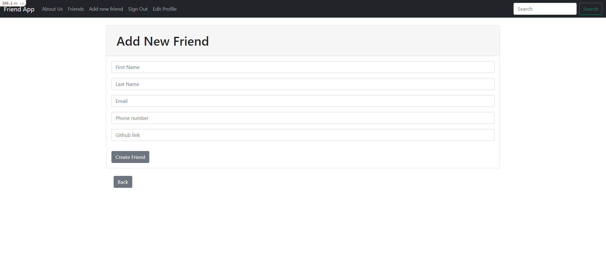
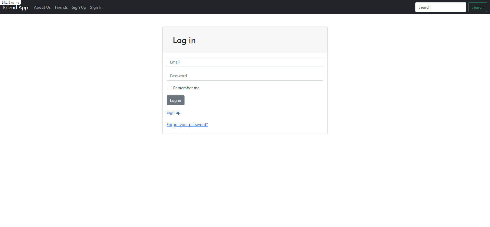
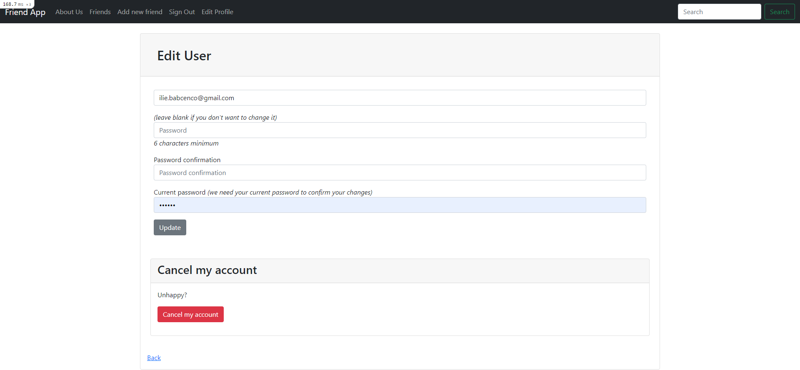
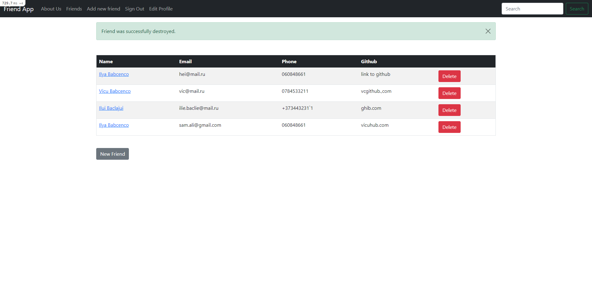

# Ruby on Rails Friends Project

This is the project from freeCodeCamp course which I did for learning purposes.

## Description

This project includes basics CRUD actions that work with sqlite. It can create, update, delete friends. The friends table shows all the friends of a particular user.
So it has a full authentification process for registration, changes user data, or deletes it.

## Built With

- Ruby on Rails
- Bootstrap

## How it looks

## There are some pages from that project:

### Add new friends page

### Login page

### Edit user page

### Friends page

### Deployment

This application is deployed on [Heroku](https://www.heroku.com/)

## Authors

👤 **Ilie Babcenco**

- GitHub: [@iliebabcenco](https://github.com/iliebabcenco)
- LinkedIn: [@iliebabcenco](https://www.linkedin.com/in/ilie-babcenco-72459a1b1/)
- Twitter: [@iliebabcenco](https://twitter.com/BabcencoIlie)

## 🤝 Contributing

Contributions, issues, and feature requests are welcome!

If you want to contribute, you can clone this project or fork it.

If you found an issue, feel free to check the [issues page](https://github.com/iliebabcenco/friends-railsapp/issues).

## Show your support

Give a ⭐️ if you like this project!
